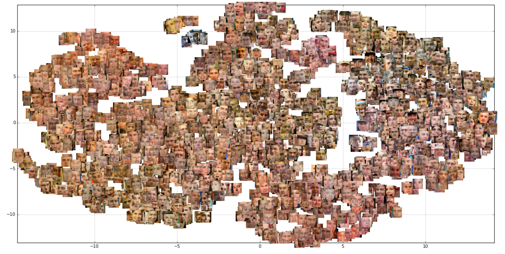
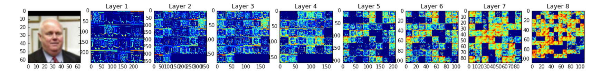
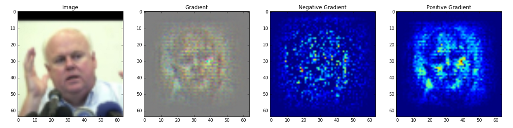
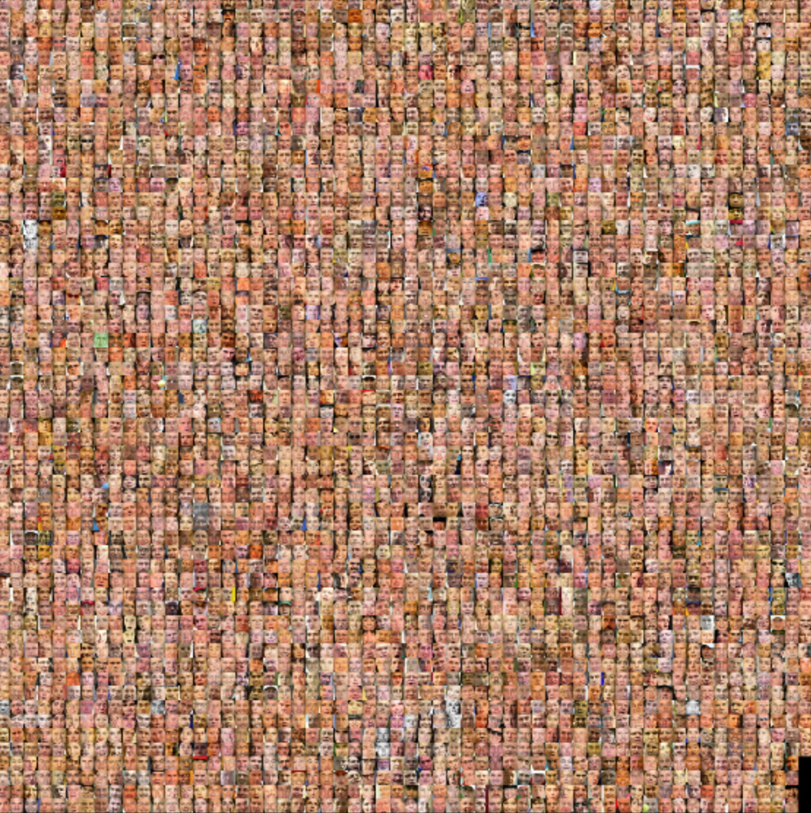

# Siamese Net


# Introduction

The siamese network is a method for training a distance function discriminatively.  Its use is popularized in many facial verification models including ones developed by Facebook and Google.  The basic idea is to run a deep net on pairs of images describing either matched or unmatched pairs.  The same network is run separately for the left and right images, but the loss is computed on the pairs of images rather than a single image.  This is done by making use of the "batch" dimension of the input tensor, and computing loss on interleaved batches.  If the left image is always the even idx (0, 2, 4, ...) and the right image is always the odd idxs, (1, 3, 5, ...), then the loss is computed on the alternating batches: `loss = output[::2] - output[1::2]`, for instance.  By feeding in pairs of images that are either true or false pairs, the output of the networks should try to push similar matching pairs closer to together, while keeping unmatched pairs farther away.

This package shows how to train a siamese network using Lasagne and Theano and includes network definitions for state-of-the-art networks including: DeepID, DeepID2, Chopra et. al, and Hani et. al.  We also include one pre-trained model using a custom convolutional network.

We are releasing all of this to the community in the hopes that it will encourage more models to be shared and appropriated for other possible uses.  The framework we share here should allow one to train their own network, compute results, and visualize the results.  We encourage the community to explore its use, submit pull requests on any issues within the package, and to contribute pre-trained models.



# Package

Siamese Network for performing training of a Deep Convolutional
Network for Face Verification on the Olivetti and LFW Faces datasets.

Dependencies:

python 3.4+, numpy>=1.10.4, sklearn>=0.17, scipy>=0.17.0, theano>=0.7.0, lasagne>=0.1, cv2, dlib>=18.18 (only required if using the 'trees' crop mode).

Part of the package siamese_net:
siamese_net/
siamese_net/faces.py
siamese_net/datasets.py
siamese_net/normalization.py
siamese_net/siamese_net.py

Look at the notebook file `siamese_net_example.ipynb` for how to use the pre-trained model to predict pairs of images or visualize layers of the model.




Also look at `siamese_net.py` for training your own model.  The default parameters will train a model on LFW without any face localization.

```
$ python3 siamese_net.py --help
usage: siamese_net.py [-h] [-m MODEL_TYPE] [-of N_OUT] [-bs BATCH_SIZE]
                      [-e N_EPOCHS] [-lr LEARNING_RATE] [-dp DROPOUT_PCT]
                      [-norm NORMALIZATION] [-f FILENAME] [-path PATH_TO_DATA]
                      [-hm HYPERPARAMETER_MARGIN]
                      [-ht HYPERPARAMETER_THRESHOLD] [-ds DATASET]
                      [-nl NONLINEARITY] [-fn DISTANCE_FN] [-cf CROP_FACTOR]
                      [-sp SPATIAL] [-r RESOLUTION] [-nf NUM_FILES]
                      [-gray B_CONVERT_TO_GRAYSCALE]

optional arguments:
  -h, --help            show this help message and exit
  -m MODEL_TYPE, --model_type MODEL_TYPE
                        Choose the Deep Network to use. ["hani"], "chopra", or
                        "custom" (default: hani)
  -of N_OUT, --output_features N_OUT
                        Number of features in the final siamese network layer
                        (default: 40)
  -bs BATCH_SIZE, --batch_size BATCH_SIZE
                        Number of observations per batch. (default: 100)
  -e N_EPOCHS, --epochs N_EPOCHS
                        Number of epochs to train for. (default: 5)
  -lr LEARNING_RATE, --learning_rate LEARNING_RATE
                        Initial learning rate to apply to the gradient update.
                        (default: 0.0001)
  -dp DROPOUT_PCT, --dropout_pct DROPOUT_PCT
                        Percentage of connections to drop in between
                        Convolutional layers. (default: 0.0)
  -norm NORMALIZATION, --normalization NORMALIZATION
                        Normalization of the dataset using either ["-1:1"],
                        "LCN", "LCN-", or "ZCA". (default: -1:1)
  -f FILENAME, --filename FILENAME
                        Resulting pickle file to store results. If none is
                        given, a filename is created based on the combination
                        of all parameters. (default: None)
  -path PATH_TO_DATA, --path_to_data PATH_TO_DATA
                        Path to the dataset. If none is given it is assumed to
                        be in the current working directory (default: None)
  -hm HYPERPARAMETER_MARGIN, --hyperparameter_margin HYPERPARAMETER_MARGIN
                        Contrastive Loss parameter describing the total free
                        energy. (default: 2.0)
  -ht HYPERPARAMETER_THRESHOLD, --hyperparameter_threshold HYPERPARAMETER_THRESHOLD
                        Threshold to apply to the difference in the final
                        output layer. (default: 5.0)
  -ds DATASET, --dataset DATASET
                        The dataset to train/test with. Choose from ["lfw"],
                        or "olivetti" (default: lfw)
  -nl NONLINEARITY, --nonlinearity NONLINEARITY
                        Non-linearity to apply to convolution layers.
                        (default: rectify)
  -fn DISTANCE_FN, --distance_fn DISTANCE_FN
                        Distance function to apply to final siamese layer.
                        (default: l2)
  -cf CROP_FACTOR, --cropfactor CROP_FACTOR
                        Scale factor of amount of image around the face to
                        use. (default: 1.0)
  -sp SPATIAL, --spatial_transform SPATIAL
                        Whether or not to prepend a spatial transform network
                        (default: False)
  -r RESOLUTION, --resolution RESOLUTION
                        Rescale images to this fixed square pixel resolution
                        (e.g. 64 will mean images, after any crops, are
                        rescaled to 64 x 64). (default: 64)
  -nf NUM_FILES, --num_files NUM_FILES
                        Number of files to load for each person. (default: 2)
  -gray B_CONVERT_TO_GRAYSCALE, --grayscale B_CONVERT_TO_GRAYSCALE
                        Convert images to grayscale. (default: True)
```

Example output of training w/ default parameters:

```
$ python3 siamese_net.py
Namespace(b_convert_to_grayscale=True, batch_size=100, crop_factor=1.0, dataset='lfw', distance_fn='l2', dropout_pct=0.0, filename=None, hyperparameter_margin=2.0, hyperparameter_threshold=5.0, learning_rate=0.0001, model_type='hani', n_epochs=5, n_out=40, nonlinearity='rectify', normalization='-1:1', num_files=2, path_to_data=None, resolution=64, spatial=False)
Dataset: lfw
Spatial: 0
Batch Size: 100
Num Features: 40
Model Type: hani
Num Epochs: 5
Num Files: 2
Learning Rate: 0.000100
Normalization: -1:1
Crop Factor: 1
Resolution: 64
Hyperparameter Margin: 2.000000
Hyperparameter Threshold: 5.000000
Dropout Percent: 0.000000
Non-Linearity: rectify
Grayscale: 1
Distance Function: l2

Writing results to: results/dataset_lfw_transform_0_batch_100_lr_0.000100_model_hani_epochs_5_normalization_-1:1_cropfactor_1.00_nout_40_resolution_64_numfiles_2_q_2.00_t_5.00_d_0.00_nonlinearity_rectify_distancefn_l2_grayscale_1.pkl

Loading dataset...
Preprocessing dataset
Loading data in siamese-net/lfw
Person: 5749/5749
(11498, 1, 64, 64)
Initializing Siamese Network...
(11498, 1, 64, 64)

Epoch 1 of 5 took 20.952s
    training loss:          0.008983
    validation loss:        0.007918
    validation AUC:         0.64
    validation F1:          0.69
```

... training will begin after downloading the dataset, pre-processing faces, and compilation (can take ~30 minutes!).  Each epoch will then take ~ 21 seconds using these default parameters using a GeForce GT 750M GPU.

# References

Chopra, S., Hadsell, R., & Y., L. (2005). Learning a similiarty metric discriminatively, with application to face verification. Proceedings of IEEE Conference on Computer Vision and Pattern Recognition, 349–356.

Donahue, J., Jia, Y., Vinyals, O., Hoffman, J., Zhang, N., Tzeng, E., & Darrell, T. (2014). DeCAF: A Deep Convolutional Activation Feature for Generic Visual Recognition. arXiv Preprint. Retrieved from http://arxiv.org/abs/1310.1531

El-bakry, H. M., & Zhao, Q. (2005). Fast Object / Face Detection Using Neural Networks and Fast Fourier Transform, 8580(11), 503–508.

Huang, G. B., Mattar, M. a., Lee, H., & Learned-Miller, E. (2012). Learning to Align from Scratch. Proc. Neural Information Processing Systems, 1–9.

Khalil-Hani, M., & Sung, L. S. (2014). A convolutional neural network approach for face verification. High Performance Computing & Simulation (HPCS), 2014 International Conference on, (3), 707–714. doi:10.1109/HPCSim.2014.6903759

Kostinger, M., Hirzer, M., Wohlhart, P., Roth, P. M., & Bischof, H. (2012). Large scale metric learning from equivalence constraints. Proceedings of the IEEE Computer Society Conference on Computer Vision and Pattern Recognition, (Ldml), 2288–2295. doi:10.1109/CVPR.2012.6247939

Li, H., & Hua, G. (2015). Hierarchical-PEP Model for Real-world Face Recognition, 4055–4064. doi:10.1109/CVPR.2015.7299032

Parkhi, O. M., Vedaldi, A., Zisserman, A., Vedaldi, A., Lenc, K., Jaderberg, M., … others. (2015). Deep face recognition. Proceedings of the British Machine Vision, (Section 3).

Sun, Y., Wang, X., & Tang, X. (2014). Deep Learning Face Representation by Joint Identification-Verification. Nips, 1–9. doi:10.1109/CVPR.2014.244

Taigman, Y., Yang, M., Ranzato, M., & Wolf, L. (2014). DeepFace: Closing the Gap to Human-Level Performance in Face Verification. Conference on Computer Vision and Pattern Recognition (CVPR), 8. doi:10.1109/CVPR.2014.220

Wheeler, F. W., Liu, X., & Tu, P. H. (2007). Multi-Frame Super-Resolution for Face Recognition. 2007 First IEEE International Conference on Biometrics: Theory, Applications, and Systems, 1–6. doi:10.1109/BTAS.2007.4401949

Yi, D., Lei, Z., Liao, S., & Li, S. Z. (2014). Learning Face Representation from Scratch. arXiv.

# License

Parag K. Mital
Copyright 2016 Kadenze, Inc.
Kadenze(R) and Kannu(R) are Registered Trademarks of Kadenze, Inc.

Licensed under the Apache License, Version 2.0 (the "License"); you may not use this file except in compliance with the License. You may obtain a copy of the License at

http://www.apache.org/licenses/LICENSE-2.0
Unless required by applicable law or agreed to in writing, software distributed under the License is distributed on an "AS IS" BASIS, WITHOUT WARRANTIES OR CONDITIONS OF ANY KIND, either express or implied. See the License for the specific language governing permissions and limitations under the License.

Apache License

Version 2.0, January 2004

http://www.apache.org/licenses/

# Kadenze

Kadenze is a creative arts MOOC working with institutions around the world to deliver affordable education in the arts.  Interested in working on problems in deep learning, signal processing, and information retrieval?  We’re always looking for great people to join our team either as interns or potentially other roles. If you are interested in working with us, contact jobs@kadenze.com.

